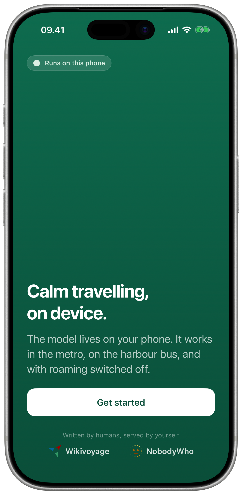
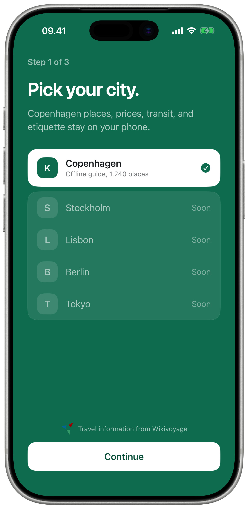

<h1 align="center">NobodyTravel 🗺️</h1>

> [!WARNING]
> NobodyTravel is a work in progress and it's not ready for prime time. This is just a sneak peek.

<p align="center">
  
  
</p>

An offline iOS city guide that uses [NobodyWho](https://www.nobodywho.ai) to an LLM powered travel agent on your phone, using travel data from [Wikivoyage](https://en.wikivoyage.org).

- [`python/`](python): Data pipeline for city guide bundles
- [`xcode/`](xcode): SwiftUI app

## Run the app

> [!IMPORTANT]
> At this current stage, I would classify this App as slop.
> I've reviewed the code, drove most of the decisions, but still needs some serious polishing!

You should have Xcode 26 or later to run this.

```bash
git clone https://github.com/nobodywho-ooo/NobodyTravel.git
cd NobodyTravel/xcode
make run-simulator
```

_Works on my machine_
